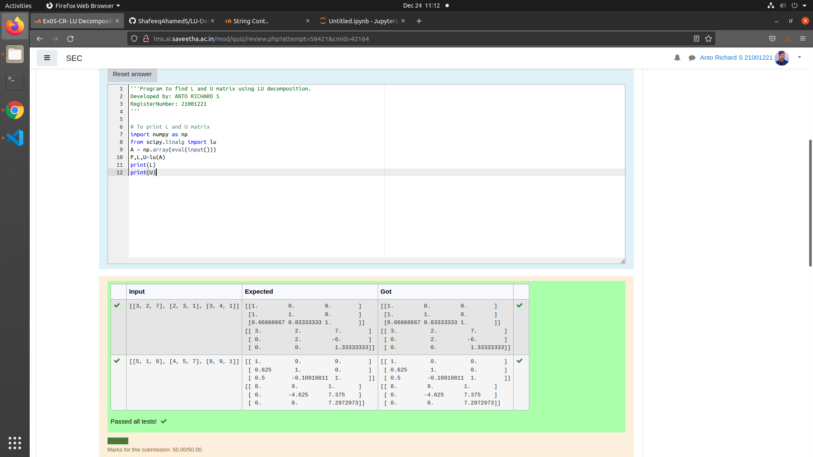
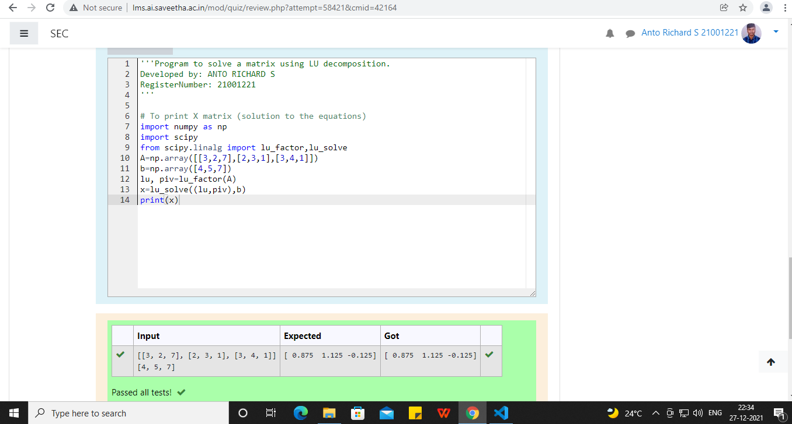

# LU Decomposition without zero on the diagonal.

## AIM:
To write a program to find the LU Decomposition of a matrix.

## Equipments Required:
1. Hardware – PCs.
2. Anaconda – Python 3.7 Installation / Moodle-Code Runner.

## Algorithm
## Step 1:
Import the numpy module to use the built-in functions for calculation.
## Step 2:
From scipy.linalg module import the lu function
## Step 3:
Get inputs from the user and assign the values in np.array().
## Step 4:
Using the lu() function, we can find the L and U matrix.
## Step 5:
Print the obtained values.
## Step 6:
End the program.

## Program:
```
'''Program to find L and U matrix using LU decomposition.
Developed by: ANTO RICHARD S
RegisterNumber: 21001221
'''

# To print L and U matrix
import numpy as np
from scipy.linalg import lu
A = np.array(eval(input()))
P,L,U=lu(A)
print(L)
print(U)
```

## Output:



## Result:
Thus the program to find the LU Decomposition of a matrix is written and verified using python programming.

# Solving a Matrix using LU Decomposition.

## AIM:
To write a program to solve a matrix using LU Decomposition.

## Equipments Required:
1. Hardware – PCs.
2. Anaconda – Python 3.7 Installation / Moodle-Code Runner.

## Algorithm:
## Step 1:
Import the numpy module to use the built-in functions for calculation.
## Step 2:
From scipy.linalg module import lu_factor and lu_solve functions for calculations.
## Step 3:
Get inputs from the user and assign the values in A and B in np.array().
## Step 4:
Using the lu_factor(), we can find the LU and pivot.
## Step 5:
Call the lu_solve function by passing lu and pivot as first argument and B as second argument.
## Step 6:
Print the variable.
## Step 7:
End the program.

## Program:
```
'''Program to solve a matrix using LU decomposition.
Developed by: ANTO RICHARD S 
RegisterNumber: 21001221
'''

# To print X matrix (solution to the equations)
import numpy as np
import scipy
from scipy.linalg import lu_factor,lu_solve
A=np.array([[3,2,7],[2,3,1],[3,4,1]])
b=np.array([4,5,7])
lu, piv=lu_factor(A)
x=lu_solve((lu,piv),b)
print(x)
```

## Output:


## Result:
Thus the program to solve the matrix using LU Decomposition is written and verified using python programming.